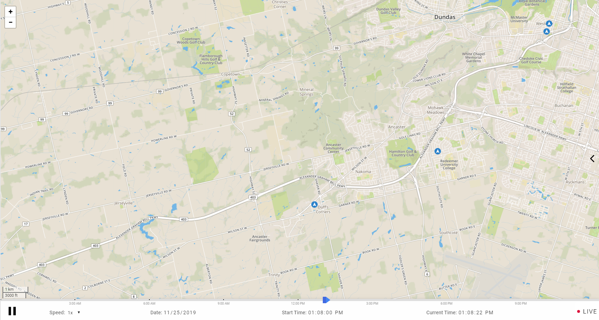
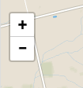
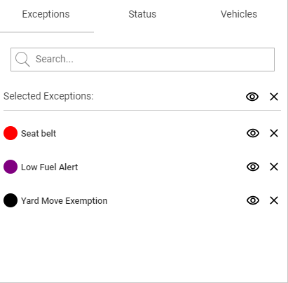
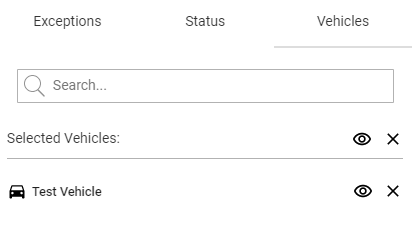
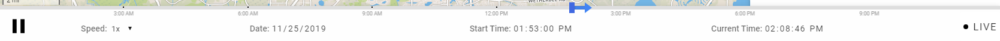
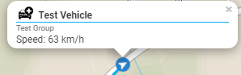
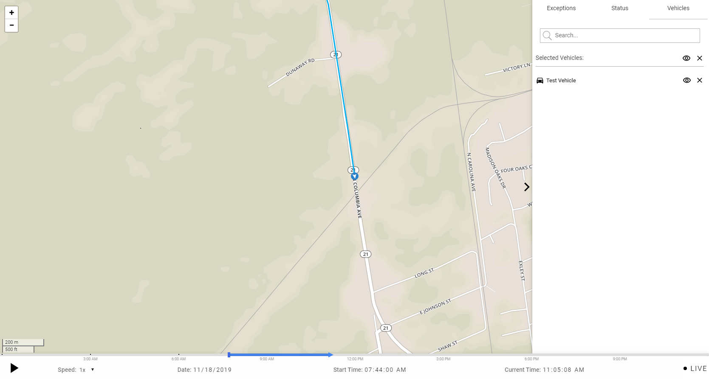
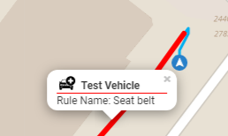
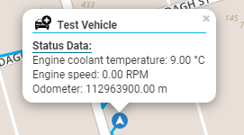

# READ ME

### Getting started

1. Download the repo.
2. Run `npm install` to install all dependencies.
3. Run `npm run build` and you should have a working mygeotab addin in the dist folder!

### Official documentation

Upon starting the map, you will be greeted with the following landing page:

<kbd></kbd>

On the top left hand side is the zoom controls.

<kbd></kbd>

### Configuration Panel

The arrow icon on the right will expand to open the configuration panel on click.

<kbd></kbd>

The three tabs in the panel allow users to search Exceptions, Statuses and filter the map by Vehicle/Groups.

The selected configuration is applied immediately upon click.

Users may toggle the visibility of the configuration selection by clicking on the eye-icon in the tab and remove the configuration by clicking on the clear button.

Configuration settings persist along sessions with the same user name, they're loaded and applied upon login.

<kbd></kbd>

Clicking on the Vehicle Icon in the Vehicle Tab will set the view to the car on the Map.

### Control Bar

On the bottom of the page is the control bar, with the following features:

<kbd></kbd>

Two sliders on top, the rectangular slider can be dragged to select a new time onwards from which the Vehicle Paths are shown on the Map.

The arrow shaped slider can be dragged to set the Current Time.

A play/pause button to the bottom left.

Playback Speed menu to the right of the play/pause button allowing users to Fast Forward on the Map.

A live button to the bottom right that bring users to the latest feed data.

A date at bottom center, that also functions as an input, allowing users to select a specific date in the past.

Two time inputs on the bottom center. The Start Time input allows users to set the start time for the Vehicle Paths and the Current time input sets the Current Time on the Map.

### Additional Features

Every vehicle marker, path and exception path will have a popup that is opened on click. It will look similar to this:

<kbd></kbd>

On clicking the black vehicle icon near the the top right of the pop up, the map will zoom into the vehicle and add it to the list of filtered vehicles:

<kbd></kbd>

If get exception data is enabled, then upon clicking an exception path, a popup will display the exception rule name, duration, as well as driver name.

<kbd></kbd>

If get status feed is enabled, then diagnostic status data would be displayed in the popup as well:

<kbd></kbd>
### How to add new Exceptions/Rules

https://www.geotab.com/video/set-rules-fleet-mygeotab/

https://www.geotab.com/video/advanced-rules-and-groups/

Any rules added in MyGeoTab will be displayed on this map if the exception has occurred, using the color selected in rule settings.

### Additional resources

https://my.geotab.com/sdk/api/apiReference.html

https://leafletjs.com/index.html

### License
MIT License

Copyright (c) 2020 Geotab Inc.